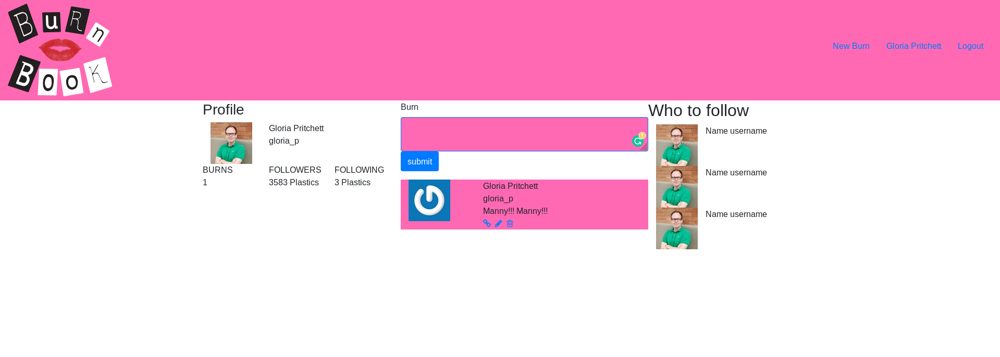

<!-- PROJECT LOGO -->
# The Burn Book: Members Only
This Project is an app built using Ruby on Rails, to implement the creation of The Burn Book, a Members Only Web app where you can post "burns" or mean posts about other people. However, you can only see who has created the "burn" post when you are signed up and signed in, otherwise, too bad! You won't know who!

<!-- TABLE OF CONTENTS -->
## Table of Contents
- [The Burn Book: Members Only](#the-burn-book-members-only)
  - [Table of Contents](#table-of-contents)
- [About The Project](#about-the-project)
- [Getting started](#getting-started)
  - [Installation](#installation)
  - [Features:](#features)
  - [Ruby Gems used in this project](#ruby-gems-used-in-this-project)
- [Authors](#authors)
- [Acknowledgements](#acknowledgements)
  - [Show your support](#show-your-support)
<!-- ABOUT THE PROJECT -->
# About The Project
This Project is an app built using Ruby on Rails, to implement the creation of The Burn Book, a Members Only Web app where you can post "burns" or mean posts about other people and only see who has posted what when you're signed up/in. It was also a way to get a lot of healthy experience with using Devise in the process.
This project demonstrates a User Role system giving the web application and native application feel all within the browser. We used Rails generators to help scaffold views. The app features the CRUD principle where we create, read, update and destroy "Burns" (posts). We used the Devise gem which makes creating an entire user role and authentication system a lot easier.

<!-- GETTING STARTED -->
# Getting started
## Installation
* Clone the repo following [this link](https://github.com/aracelicaes/re-former)
* Install all dependencies running from terminal using the command <pre><code>bundle install
</code></pre>
* Run from terminal <pre><code>bin/rails server
</code></pre>

## Features:
* Ruby 2.7.0
* Rubocop
* Ruby Gems
* Postgresql

## Ruby Gems used in this project

* [Bulma](https://github.com/joshuajansen/bulma-rails) - CSS Framework
* [Guard](https://github.com/guard/guard) - For livereloading SCSS, JS, CSS & ERB files.
* [Simple Form](https://github.com/plataformatec/simple_form) - For simpler forms layouts.
* [Devise](https://github.com/plataformatec/devise) - Easy User Roles and Authentication.
* [Gravatar_image_tag](https://github.com/mdeering/gravatar_image_tag) - Integrated image tag that issues gravatars.

<!-- CONTACT -->
# Authors
👤 **Ara Camarillo**

- Github: [aracelicaes](https://github.com/jessicafarias)
- Twitter: [@Ara_CE_93](https://twitter.com/Ara_CE_93)
- Linkedin: [Ara Camarillo](www.linkedin.com/in/ara-camarillo)

👤 **Jessica Farias**

- Github: [jessicafarias](https://github.com/jessicafarias)
- Twitter: [@FariasRosado](https://twitter.com/FariasRosado)
- Linkedin: [jessica-michelle-farias-rosado](https://www.linkedin.com/in/jessica-michelle-farias-rosado/)

📄 **Project Link: [Click Here](https://github.com/aracelicaes/twitter_clone/tree/develop)**
<!-- ACKNOWLEDGEMENTS -->
# Acknowledgements
- [Microverse](https://microverse.org)
- [Best-README-Template](https://github.com/othneildrew/Best-README-Template)
- [Rails Guides](https://guides.rubyonrails.org/)
- [The Odin Project](https://www.theodinproject.com/courses/ruby-on-rails/lessons/authentication#your-task)
- [Andy Leverenz Web-Crunch Youtube Tutorials](https://youtu.be/5gUysPm64a4)

## Show your support

Give a ⭐️ if you like this project!
